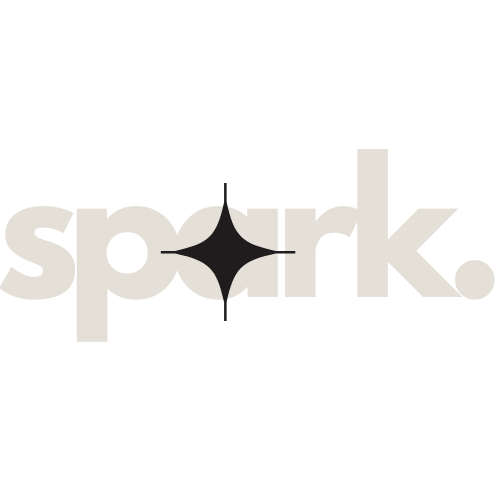

<div align="center">
  
  
  <h1>⚡ Sparklab Dev Code - Website Oficial</h1>

  <p>
    Landing page premium desenvolvida para a Sparklab, focada em demonstrar autoridade em desenvolvimento Web, Mobile e Inteligência Artificial.
  </p>

  <p>
    <a href="#-sobre">Sobre</a>&nbsp;&nbsp;&nbsp;|&nbsp;&nbsp;&nbsp;
    <a href="#-tecnologias">Tecnologias</a>&nbsp;&nbsp;&nbsp;|&nbsp;&nbsp;&nbsp;
    <a href="#-diferenciais">Diferenciais</a>&nbsp;&nbsp;&nbsp;|&nbsp;&nbsp;&nbsp;
    <a href="#-contato">Contato</a>
  </p>

  <p>
    
    
    
    
    
  </p>
</div>

---

## 🚀 Sobre o Projeto

O site da **Sparklab** foi construído para ser mais do que uma página de vendas: é um portfólio de engenharia de software. Utilizando o conceito de **Glassmorphism Elétrico**, a interface une a sobriedade do preto e bege com a energia do roxo vibrante da marca.

Este projeto reflete nossa especialidade em criar soluções institucionais e personalizadas, unindo o que há de mais moderno no ecossistema Frontend.

## ✨ Diferenciais Técnicos

* **💎 Design Glassmorphism:** Interface moderna com desfoques e transparências dinâmicas via Tailwind CSS.
* **🌍 Suporte Multilíngue:** Integração estratégica de tradução para alcance global.
* **🎭 Animações Fluidas:** Experiência imersiva utilizando Framer Motion para transições de estado e scroll.
* **📱 Responsividade Total:** Adaptado perfeitamente para dispositivos mobile e desktops de alta resolução.
* **⚡ Performance:** Score otimizado no Lighthouse graças ao uso do Vite e componentes enxutos.

---

## 🛠 Tecnologias

- **Frontend:** React.js com TypeScript
- **Estilização:** Tailwind CSS (Arquitetura utilitária)
- **Roteamento:** Wouter (Leve e performático)
- **Ícones:** Lucide React
- **Animações:** Framer Motion

---

## 💻 Como Rodar

```bash
# Clone o repositório
git clone [https://github.com/jRoblxz/SparkLabSite.git](https://github.com/jRoblxz/SparkLabSite.git)

# Acesse a pasta
cd SparkLabSite/client

# Instale as dependências
npm install

# Rode o projeto
npm run dev


```

<div align="center">
Desenvolvido por <strong>João Roblez</strong> • Sparklab Dev Code ⚡
</div>
